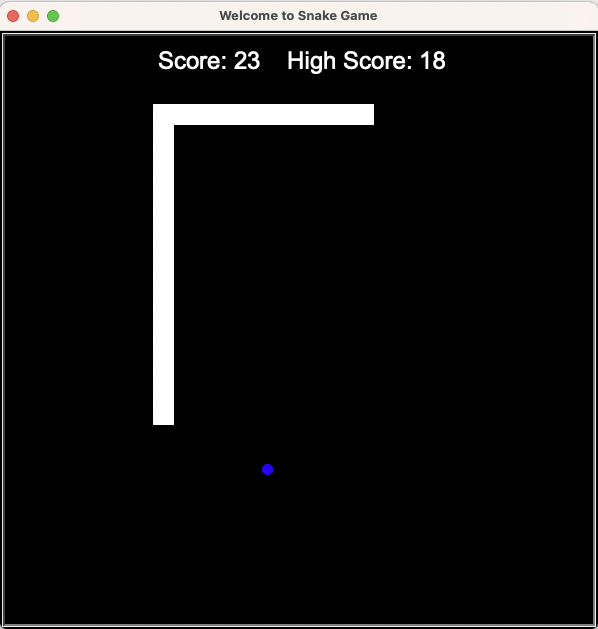

# 🐍 Snake Game

A classic Snake game built with Python using the `turtle` graphics module.  
This project demonstrates **object-oriented programming (OOP)** with separate classes for the Snake, Food, and Scoreboard.

---

## 🎮 Features

- Snake grows longer when it eats food.
- Scoreboard with persistent **high score** (saved in `high_score.txt`).
- Collision detection with food, wall (wrap-around), and tail.
- Option to restart the game after Game Over.

---

## 🛠️ Technologies

- Python 3
- `turtle` module (for graphics)
- OOP principles (classes: Snake, Food, Scoreboard)

---

## ▶️ How to Run

1. Clone this repo:
   ```bash
   git clone https://github.com/Moh-shz/snake-game.git
   cd snake-game
   ```
2. Run the game:
   ```bash
   python main.py
   ```

---

## 🎮 Controls
- **W** → Move Up  
- **S** → Move Down  
- **A** → Move Left  
- **D** → Move Right  

Use these keys to control the snake and try to get the highest score!

---

## 📂 Project Structure

```
snake-game/
│
├── main.py          # Entry point, runs the game loop
├── snake.py         # Snake class (movement, growth, reset)
├── food.py          # Food class (randomly spawning food)
├── scoreboard.py    # Scoreboard class (score + high score with file handling)
├── high_score.txt   # Stores the highest score achieved
│
├── images/
│   └── screenshot.png   # Demo screenshot
│
└── README.md        # Project documentation
```

---

## 📸 Screenshot



---

## 🚀 Future Improvements

- Add sound effects
- Difficulty levels (increasing speed)
- Improved graphics/skins for Snake and Food
